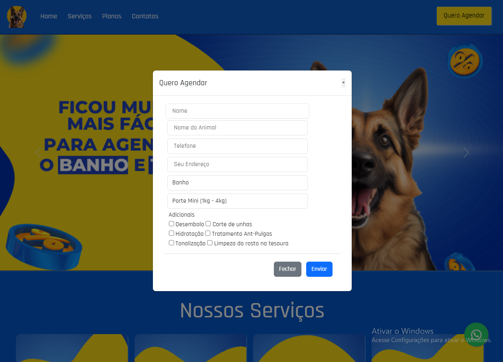

  

<h1 align="center"> Projeto de Agendamento de Banho e Tosa</h1>
Este é um projeto de site para agendamento de banho e tosa em um pet shop ou clínica veterinária. Com este sistema, os clientes podem agendar o banho e tosa de seus animais de estimação com facilidade, e a equipe do pet shop pode gerenciar os agendamentos de forma eficiente.

<h1 align="center"> Versão Desktop </h1>

  

<h1 align="center"> Versão Mobile </h1>

  

<h1 align="center"> Tecnologias Usadas </h1>

HTML

CSS

Javascript

Bootstrap

 

<h1 align="center"> Abra no seu navegador clicando no link  ↓ </h1>

https://agendamentopet.netlify.app/

<h1 align="center"> Usando GIT, Copie o repositório com o comando: </h1>

git clone https://github.com/LSacerdote/Agendamento-Petshop.git

Abra index.html com o seu browser para ver o resultado.

             
